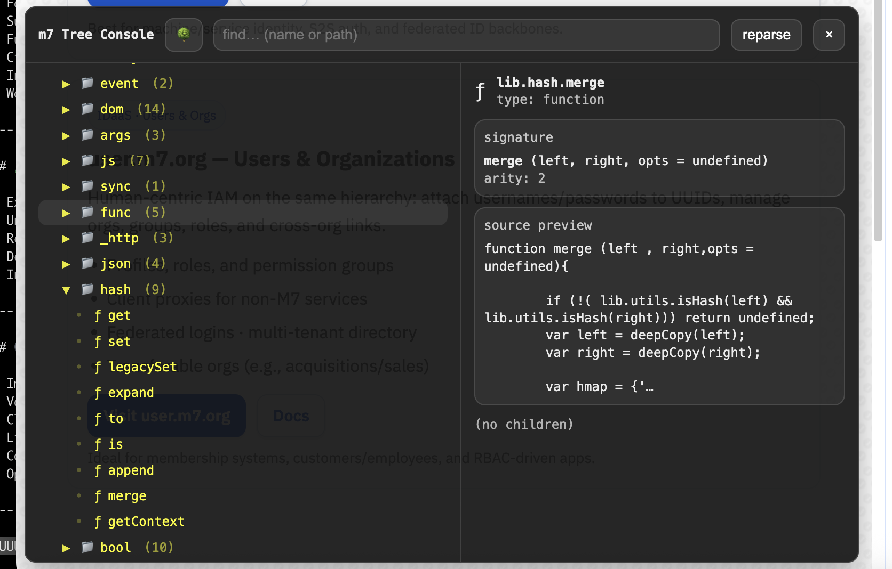

# m7-js-lib-tree

**Runtime JavaScript Tree Inspector & Console**

A lightweight developer tool for **exploring, scanning, and reverse-engineering large JavaScript object graphs at runtime** — designed specifically to work with the **M7 library ecosystem**, but usable standalone.

---

## 🔍 About

M7 has accumulated **over 25 years of JavaScript libraries**, the vast majority of which are **well-designed, battle-tested, and still in active use**. Over time, this has resulted in a very large and capable toolchain that:

* spans many problem domains
* loads incrementally at runtime (by design)
* exposes large, composable APIs
* prioritizes reuse over reinvention

**m7-js-tree** exists to make it **easy to *************************find************************* what already exists**.

The primary goal is not to "understand" legacy code, but to **quickly locate functions, utilities, and subsystems** so you don’t end up rewriting something you’ve already written 500 times before.

It builds an **enriched parse tree** of live JavaScript objects and provides an **inline interactive console** to:

* search for libraries, functions, and classes
* browse object hierarchies when needed
* inspect function signatures and metadata
* jump directly to relevant parts of the API
* safely navigate large, runtime-assembled graphs

This is **not** a static analyzer — it reflects **what is actually loaded and available at runtime**, which is critical when working with large, on-demand systems.

---

### Usage
use the '~' or backticks(`) to toggle minimize or open the panel.



## 📦 Installation


### Option 1: With M7 library (recommended)

```html
<script type="module" src="https://static.m7.org/vendor/m7-js-lib-tree/src/auto.js"></script>
```

This automatically registers the tree console under:

```js
lib.tree.console(lib);
```

---

### Option 2: Direct import (standalone or custom wiring)

```js
import openConsole from "./m7-js-tree/index.js";

openConsole(window.lib); // or any object
```

No bootstrap system required.

---

## ✅ Requirements

* **Required:** modern browser (ES modules)
* **Optional:** `m7-js-lib` (for automatic registration & integration)

This tool **does not require** M7 libraries to function — any object can be inspected.

---

##

---

## 🧠 Description

m7-js-tree traverses JavaScript objects recursively and produces a structured tree representation:

* hashes / objects
* arrays
* functions
* classes
* scalars
* circular references

The tree can be viewed as:

* a collapsible hierarchy
* a searchable index
* an inspection surface for functions and classes

The inline console UI is intentionally minimal and dependency-free, designed for **debugging, archaeology, and discovery**, not for production end-user interfaces.

---

## 🛠️ Current Features

* Runtime tree parsing
* Collapsible tree view
* Fast path-based inspection
* Substring & predicate search (`find`)
* Function signature extraction
* Circular reference detection
* Inline DOM console (toggleable)
* Works with `window`, `lib`, or any object

---

## 🧪 Intended Use Cases

* Exploring undocumented or legacy APIs
* Understanding runtime-loaded modules
* Reverse-engineering large object graphs
* Debugging complex application state
* Internal developer tooling

---

## 🧭 TODO / Roadmap

* Improved UI / keyboard navigation
* Variable root switching (`lib`, `window`, custom)
* Class mining & prototype chain views
* Link nodes to online docs / wiki
* Copy-path and deep-link support
* Optional persistence of tree state
* Package and library searching via repositories usable with **m7BootStrap** ([https://github.com/linearblade/m7BootStrap](https://github.com/linearblade/m7BootStrap))

---

## 📜 License

See [`LICENSE.md`](LICENSE.md) for full terms.

Free for personal, non-commercial use.
Commercial licensing available under the **M7 Moderate Team License (MTL-10)**.

---

## 🤖 AI Usage Disclosure

See:

* [`docs/AI_DISCLOSURE.md`](docs/AI_DISCLOSURE.md)
* [`docs/USE_POLICY.md`](docs/USE_POLICY.md)

For permitted use of AI in derivative tools or automation layers.

---

## 📬 Contact

**Author & Maintainer:** M7 Development Team

* **Website:** [https://m7.org](https://m7.org)
* **Email:** [support@m7.org](mailto:support@m7.org)
* **Legal:** [legal@m7.org](mailto:legal@m7.org)
* **Security:** [security@m7.org](mailto:security@m7.org)
* **GitHub:** [https://github.com/linearblade](https://github.com/linearblade)
